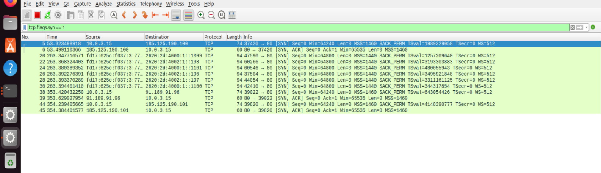
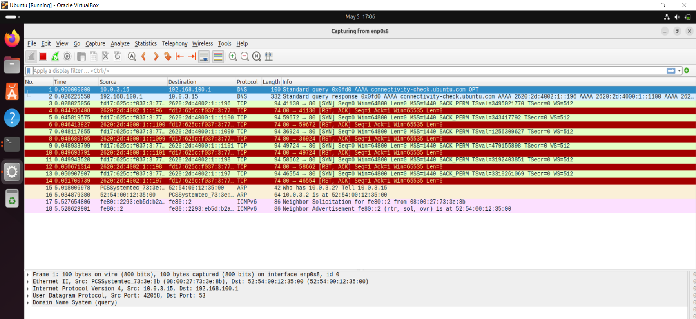
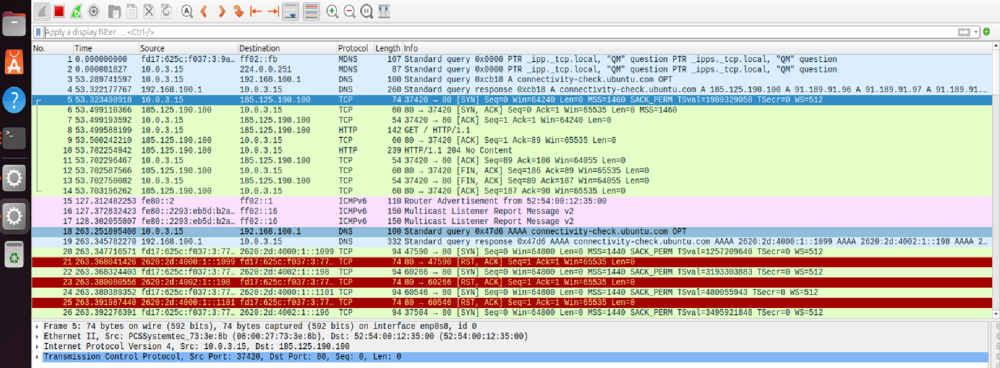
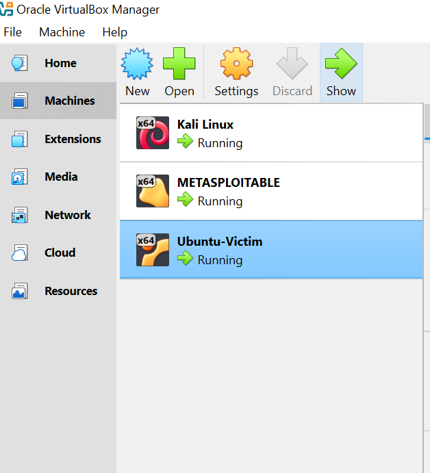
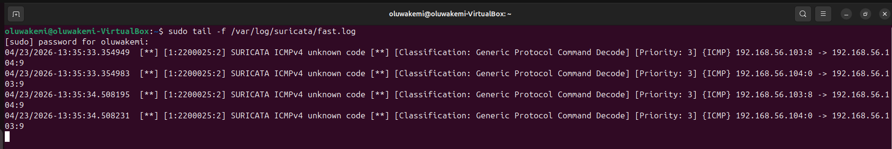
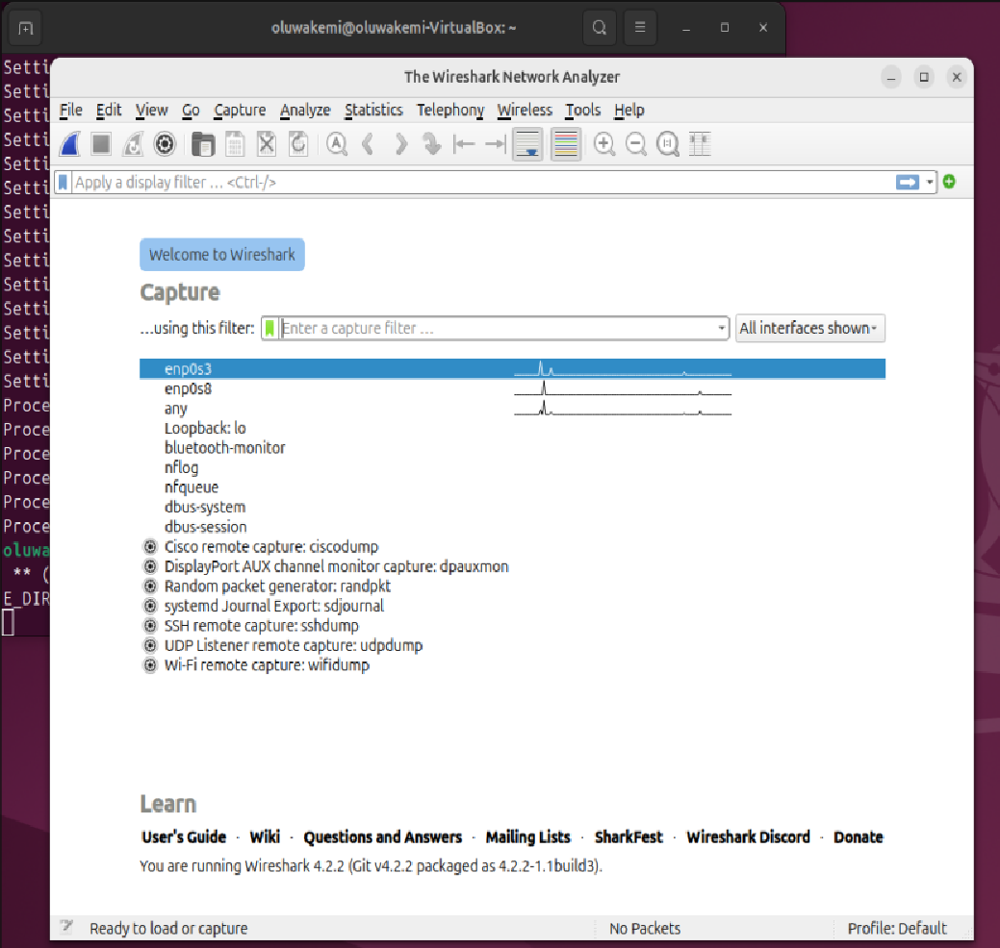

# Network Intrusion Detection System (NIDS) Lab

## Overview

This project demonstrates the design and implementation of a Network Intrusion Detection System (NIDS) lab for monitoring and detecting suspicious network activity.

The lab simulates reconnaissance traffic using Kali Linux and Nmap against a Metasploitable target while Ubuntu monitors traffic using Wireshark and Suricata.

---

# Lab Architecture

| Machine | Role | Tools |
|---|---|---|
| Kali Linux | Attacker | Nmap |
| Metasploitable | Victim/Target | Vulnerable Services |
| Ubuntu | Monitoring Sensor | Wireshark, Suricata |

---

# Tools Used

- VirtualBox
- Kali Linux
- Ubuntu
- Metasploitable
- Wireshark
- Nmap
- Suricata

---

# Attack Simulation

Reconnaissance activity was simulated using Nmap:

```bash
nmap -Pn -sT <target-ip>
nmap --script vuln <target-ip>
```

---

# Detection Evidence

## Wireshark TCP SYN Analysis

Wireshark analysis showing repeated TCP SYN packets followed by RST/ACK responses during simulated reconnaissance activity.

This pattern is consistent with scanning behavior and unauthorized service discovery attempts.



---

# Final Detection Evidence

The final analysis identified repeated TCP SYN packets and reset responses captured on the active monitoring interface.



---

# Live Traffic Capture

Wireshark successfully captured live network traffic including TCP, DNS, ARP and ICMPv6 protocols.



---

# SOC Analyst Skills Demonstrated

- Packet Analysis
- Network Monitoring
- Wireshark Traffic Analysis
- TCP Flag Interpretation
- Reconnaissance Detection
- Linux Administration
- IDS Monitoring
- Troubleshooting
- Technical Reporting

---

# Challenges Encountered

- Incorrect interface selection initially showed limited traffic
- Suricata alert inconsistency in virtualized environments
- Network routing visibility issues in VirtualBox

These issues were resolved through interface analysis and packet-level investigation.

---

# Future Improvements

- Integrate Suricata logs with Splunk or ELK
- Implement IPS functionality
- Add brute-force attack simulations
- Create custom Suricata detection rules

---

# Project Documents

- [NIDS Defence Slides (PPTX)](docs/nids-project-defence-slides.pptx)
- [NIDS Defence Slides (PDF)](docs/nids-project-defence-slides.pdf)
- [NIDS Project Report (PDF)](docs/nids-project-report.pdf)
- [NIDS Project Report (DOCX)](docs/nids-project-report.docx)
- [Traffic Analysis Report](findings/traffic-analysis-report.md)
# Screenshots

## Lab Setup



---

## Suricata Fast Log



---

## Wireshark Interface Selection



---

## Live Traffic Capture


---

## TCP SYN and RST Analysis


---

## Final Detection Evidence


---

# Author

**Oluwakemi Bankole**  
Cybersecurity Analyst | SOC Analyst | Penetration Testing Enthusiast
